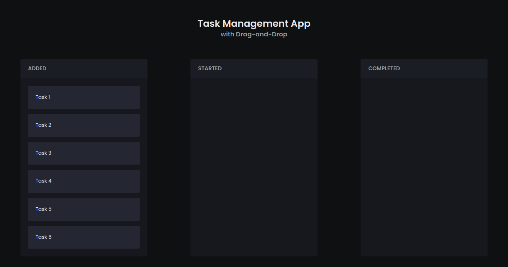
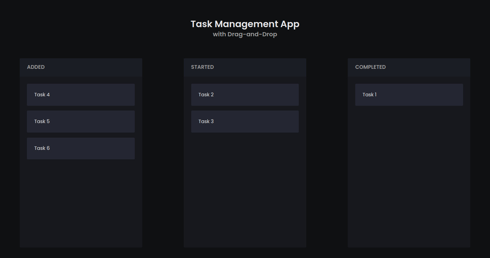

# Task Management App with Drag-And-Drop

## Screenshots



  *Fig. 1: Initial state of task management app.*


  *Fig. 2: After dragging and dropping tasks.*


## Getting Started

### Prerequisites

Make sure you have the following software installed on your machine:

- Node.js: [Download and Install Node.js](https://nodejs.org/)
- npm (Node Package Manager): This is included with Node.js installation.

### Installing

1. Clone the repository to your local machine:
    
    `git clone https://github.com/alim-ansari/task-management-app.git`
    
2. Navigate to the project directory:
    
    `cd task-management-app`

    
3. Install the project dependencies:
    
   `npm install`


### Running the App

Once the installation is complete, you can run the app:

`npm start` 

This will start the development server, and the app will be accessible at http://localhost:3000 in your browser.

## Folder Structure

The project structure is organized as follows:

```
task-management-app/
│
├── public/
│   ├── index.html
│   └── ...
│
├── src/
│   ├── components/
│   │   ├── Container.js
│   │   ├── TaskList.js
│   │   └── ...
│   ├── App.js
│   ├── index.js
│   └── ...
│
├── .gitignore
├── package.json
├── README.md
└── ...
```